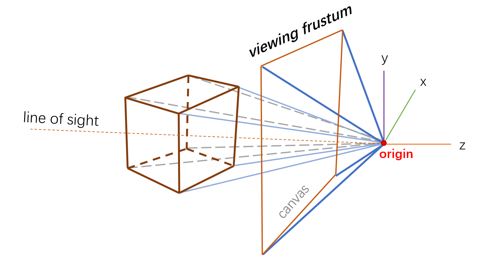

# hands-on-Computer-Graphics

That is a project about simple computer graphics for beginners,with the tutoriel: [Scratchapixel](https://www.scratchapixel.com/index.html "Scratchapixel").

And it will include my creation of **_CG_** in the future.

---

### Simple Raytracer

File folder 'raytracer' is a simple raytracer from Scratchpixel;

In order to get the graphics we render,enter the dictionary `.\raytracer`in terminal, then:

To compile raytracer.cpp:

`c++ -O3 -o raytracer.exe raytracer.cpp`

> You can change the name and location of the output file in function render.The default name is raytracer.ppm in now dictionary.

To run raytracer.exe:

`./raytracer.exe`

We will see file `raytracer.ppm` in now dictionary after running.

Open the .ppm file in Photoshop to see it and save its .png file:

---

### Box Projection

Known: Coordinates of six vertices, width and height of our canvas, use the function **_projection_**;

Compile and run to print the Projection coordinates on the console.

